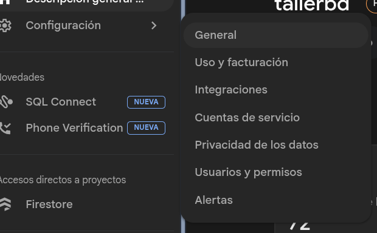
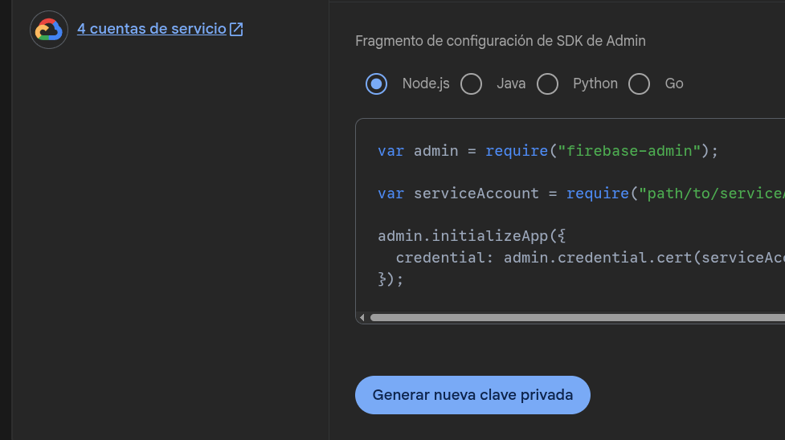

# instalacion

Para el backend como se utilizo firebase, necesitas crear una cuenta de firebase y habilitar el servicio de firestore.
luego en la consola, en la configuracion del proyecto.



en la pestaña de cuentas de servicio.



Haga click en node.js, y generar nueva clave privada, esto le descargara un .json, renombrela como tokenfirebase.json y muevala a la carpeta backend.

con esto ya tendra las credenciales configuradas en backend para el uso de la base de datos.

##  Backend

para la instalacion de dependencias solo tiene que entrar por terminal a la ruta ./backend, y utilizar el comando 
```
npm install
```
para rellenar con datos de prueba la base de datos firestore tiene que utilizar 
```
node seeds.js
```
para levantar el servidor en localhost tiene que utilizar:
```
npm run dev
```

## Frontend 

para la instalacion de dependencias solo tiene que entrar por terminal a la ruta ./backend, y utilizar el comando 
```
npm install
```
para levantar el servidor en localhost tiene que utilizar y ver la pagina web:
```
npm run dev
```
En la misma consola aparecera la url a la que se tiene que conectar con su navegador web, habra 3 urls, la que sirve la pagina web es: 
https://localhost:5173/

Para que todo este funcionando tienen que estar los dos servicios levantados a la vez, en dos terminales distintas. 