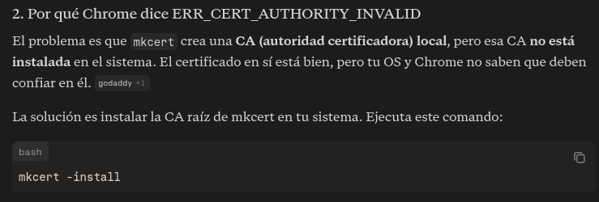

# Generalidades

Para el uso de la IA se utilizo claude sonnet 4.6 thinking

## Backend

- Para las consutas con firebase y su configuracion.
- Para encontrar la solucion a quitar el ETag y manipular la cabecera para el objeto responses.
- Para la utilizacion de passport se utilizo como referencia [video](https://www.youtube.com/watch?v=EcCIlxfxc4g)
- seeds.js totalmente generado por IA 

## Frontend

- Para las peticiones de mi frontend hacia el backend.
- Para los estilos basicos de los componentes y arreglos menores de los estilos.
- navegacion por la URL con react, me dio una recomendacion segun mi experiencia utilizando angular
- para problemas con el formateo de las fechas.
- para la conversion de los archivos a base64 que necesita mi backend para poder almacenar archivos.
- para los interceptors del token [pagina web](https://medium.com/@barisberkemalkoc/axios-interceptor-intelligent-db46653b7303)

siguiendo la guia del docente (url)[https://dev.to/josuebustos/https-localhost-for-node-js-1p1k], se aplico a backend y frontend los certificados, y se añadio la correspondiente configuracion para https, una prueba en la imagen


Se tuvo que añadir el comando de:
```
mkcert -install
```
para que el navegador confiara en los certificados segun la IA

